# 20210915First.ipynb

相比较baseline主要改动了如下地方：

- 增加了Transformer用于training和valid的data augmentation
- 增加了Semi-Supervised的部分
- 在原有的三层卷积层的基础上增加了两层
- 将原有的线性输出层，加入了BatchNormal和Dropout
- 增加了训练的epoch
- 将threshold修改为`0.85`

结果：Private Score为`0.61207`, Public Score为`0.59557`

## 问题分析

通过输出loss和acc的图，发现valid集在30轮后的loss不断增加，acc精度在0.6附件不断震荡。说明这次调参是不work的。因为修改参数太多，也不清楚哪部分是主要影响，所以需要进一步调参分析。

# 20210915Second.ipynb

相比较20210915First修改主要为：

- 将半监督的threshold从`0.85`修改为`0.92`
- 将步长lr从`0.0003`修改为`0.0001`
- 将第一层的Dropout由`0.65`修改为`0.55`，将第二层的Dropout由`0.45`修改为`0.4`

- 增加了一层conv

## 结果

acc

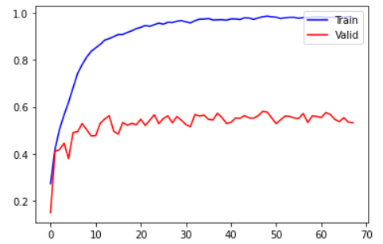

loss

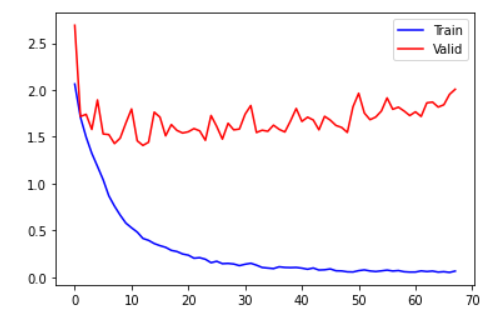

## 问题分析

30轮之后train的loss就不变化了，而valid还在不断振荡。说明这次跑模型还是不work的，于是在70轮就停了分析原因大概率是data augument那块做的有问题，也有可能过早加入半监督学习的问题。

# 20210916First.ipynb

相比较上次有如下更新：

- 将best_acc的门槛由`0.6`改成`0.55`
- 将tranformer的内容重新改了一下
- 将学习率lr由0.0001调为0.00005

## 结果

acc

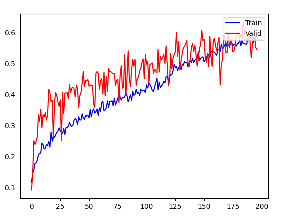

loss

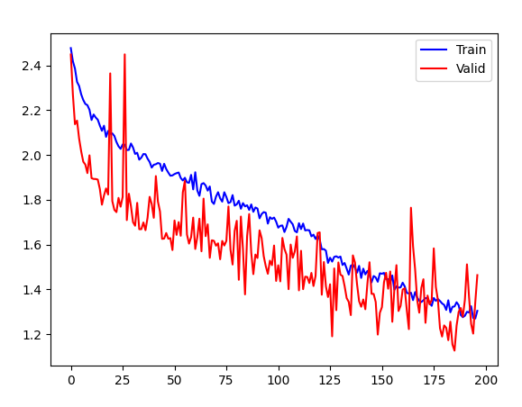

## 问题分析

发现一旦半监督学习加入新数据后，acc和loss就会振荡。直观感觉应该是半监督学习时机的问题，在前期model弹性比较大的时候加入半监督学习，容易导致学习混乱。也有可能是学习率过小，导致陷入局部最优跳不出来。

# 20210916Second.ipynb

相比较上次有如下更新：

- 将best_acc的门槛由0.6改为0.65
- 将半监督学习的threshold由0.85改成0.9
- 将半监督学习的频次降低，由每4个epoch一次降低为8个epoch一次
- 将学习率由0.00005改为默认参数
- 将batch_size由128改为了200

colab每次跑200轮，差不多300多个小时老自动关了。连模型参数都下载不了。。没啥办法。。。之后还是得在自己机上跑

acc

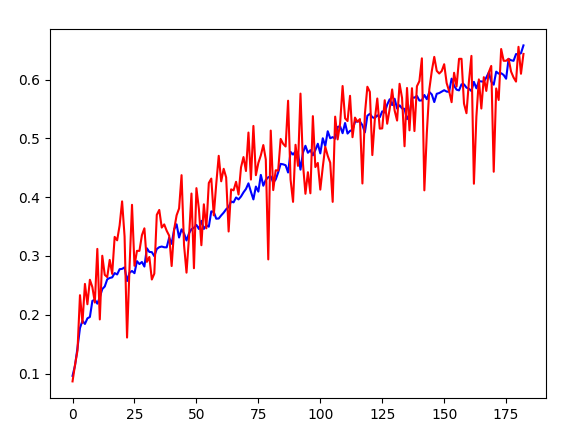

loss

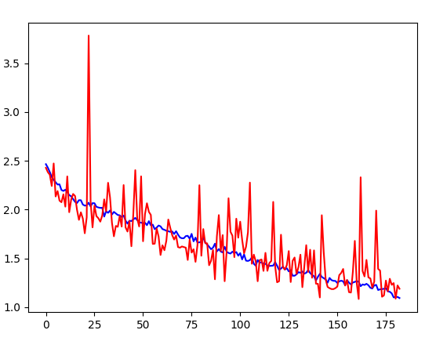

## 问题分析

这次还不如上次调参，

# 20210916There.ipynb

相比较上次有如下更新：

- 将best_acc的门槛由0.65改为0.7
- 将学习率由默认参数改为0.00001
- 将batch_size由200改为了64

acc

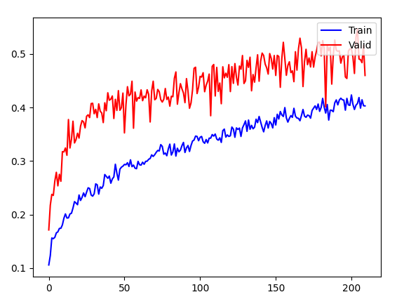

loss

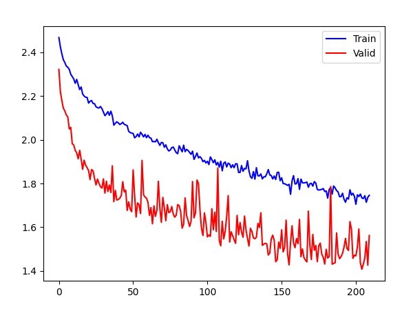

# Show me your power! Pre-trained Resnet~

尽管文档强调了不要使用预训练的resnet，但是在无数次调参后还是应该感受一下站在前人肩膀上的感觉是什么样的。

## Only Resnet

在不使用data augmentation和semi-suprivised的前提下，训练80轮的效果如下,acc

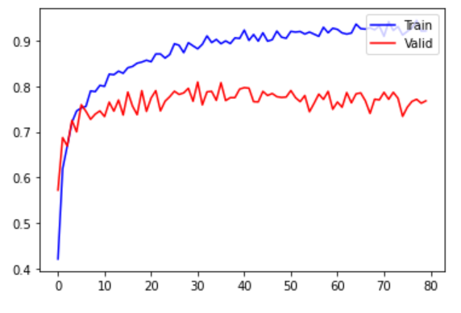

lose

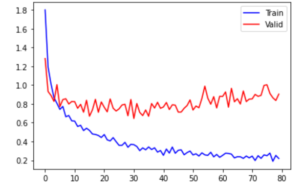

从图表来看,在30轮~40轮的时候是最好的.之后的loss波动上升，可能是训练太多导致过拟合的原因？

Private Score 0.77047

Public Score 0.79032

离hard baseline还是有些差距，参数也不修改，加入data augmentation和半监督或许能突破？

## Hard Baseline? Yes!

在使用data augmentation和semi-suprivised的前提下，30轮的情况如下：

loss

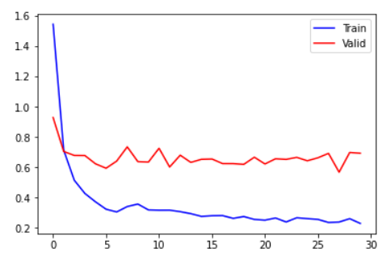

acc

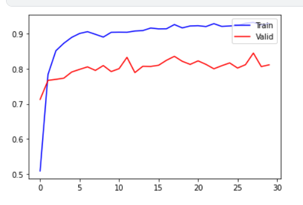

可以发现valid平均在0.8以上，两次跳动到0.83以上

Private Score 0.83442

Public Score 0.82019

# End

这次hw3的调参之旅宣告结束，总体而言有以下的思考。

- 学习的时候自己搭建简易model是非常必要的，因为它可以让你绞尽脑汁去思考如何去调参和加入更多方法去让模型loss更小，acc更高。从而快速查资料学习
- 如果打比赛或者科研生产，站在前人的肩膀上是非常必要的，一个好的pre-trained模型，一个好的方法比你浪费半个月自己调参炼丹要快捷便利的多。

同时还有以下的问题需要解决：

- 尽管已经做了三次homework了，但是对于Dataset，DataLoader, Validation等等PyTorch的诸多细节还是完全没有理清楚，导致写半监督学习的时候犯了很严重的错误，浪费了大量时间。
- 每次调参的时候还是蛮迷茫的，不清楚到底应该把batch_size往大调还是往小调，同时对于valid的大幅度振荡也不知道应该修改什么参数。
- 与其花5个小时在调参炼丹上，不如在github和google上多看看其他人的实际心得。
